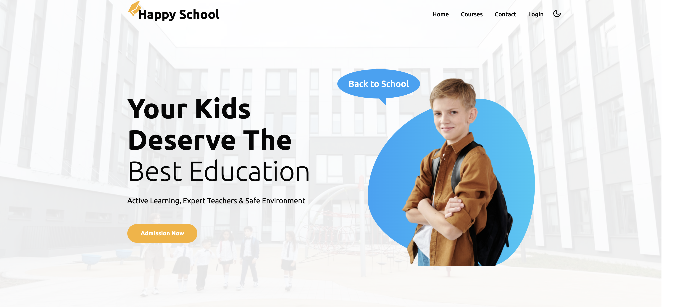
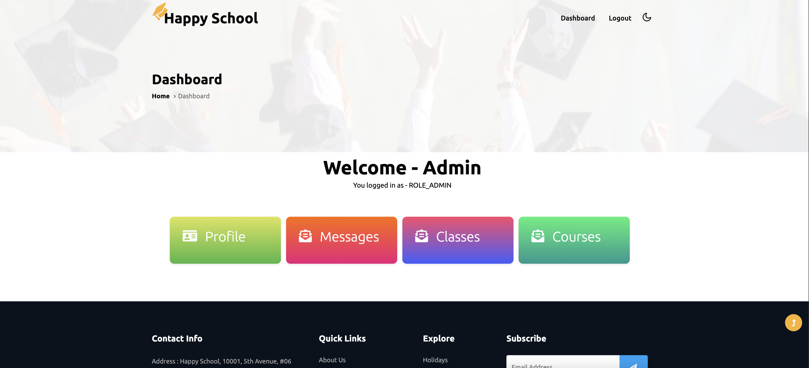
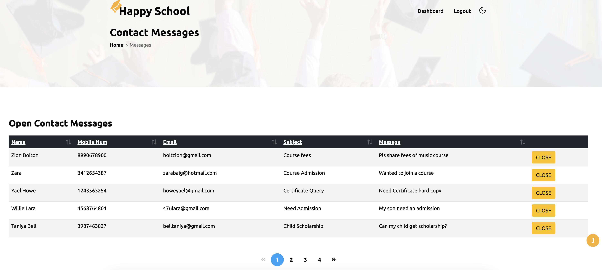
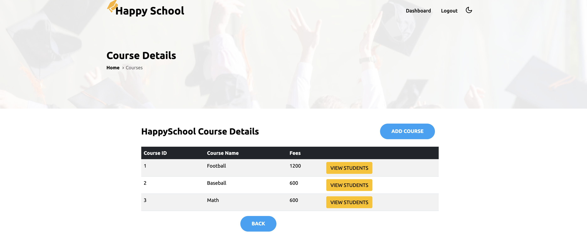

# Happy School

**Happy School** is a school management web application with a student and admin portal, designed to manage various academic and administrative tasks efficiently.

## Features

- **Student Portal**: Allows students to view their profiles, grades, and enrollments.
- **Admin Portal**: Admins can manage student information, courses, and grades.
- **Authentication & Authorization**: Implemented with Spring Security for secure user access.
- **Responsive Design**: Built using Thymeleaf for easy rendering and user interaction.
- **Database Management**: MySQL database hosted on AWS for reliable data storage and retrieval.

## Technologies Used

### Backend

- **Spring MVC**: Manages the request handling and view rendering.
- **Spring Boot**: Facilitates rapid development with embedded servers and dependency management.
- **Spring Security**: Ensures secure user authentication and authorization.
- **Spring Data JPA**: Simplifies database access with ORM.
- **Spring Data REST**: Exposes RESTful APIs.
- **Spring Boot Actuator**: Provides production-ready features for monitoring and management.

### Frontend

- **Thymeleaf**: Template engine for dynamic HTML rendering.
- **Spring Boot Admin**: Monitors and manages Spring Boot applications in real-time.

### Database

- **MySQL**: Hosted on AWS for robust and scalable database management.

## Setup and Installation

### Prerequisites

- Java 17 or higher
- Maven
- MySQL database (ensure to configure connection details in `application.properties`)

### Steps

1. **Clone the repository**:
   ```bash
   git clone https://github.com/jungchechang/Happy_School.git
   cd happy-school
2. **Configure MySQL database**:
   ```bash
   spring.datasource.url=jdbc:mysql://localhost:3306/happyschool
   spring.datasource.username=your_username
   spring.datasource.password=your_password
3. **Run the SQL schema**:
   - Use the school_schema.sql script located in src/main/resources/ to set up the initial database schema
    
5. **Load initial data**:
   - After setting up the schema, load the initial data using school_data.sql
    
6. **Run the application**:
   ```bash
   mvn clean install
   mvn spring-boot:run
7. **Access the application**:
   ```bash
   http://localhost:8080

## Screenshot
### Home



### Admin Panel



### Message Management



### Course Management


